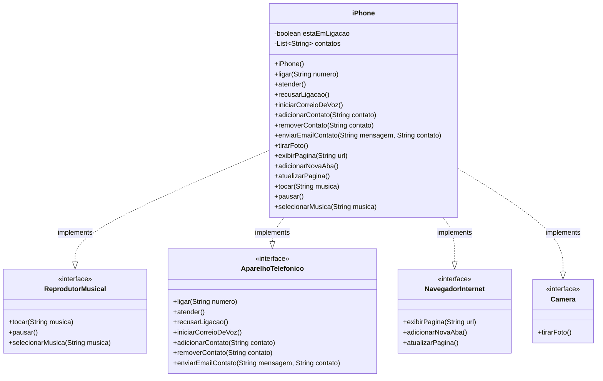
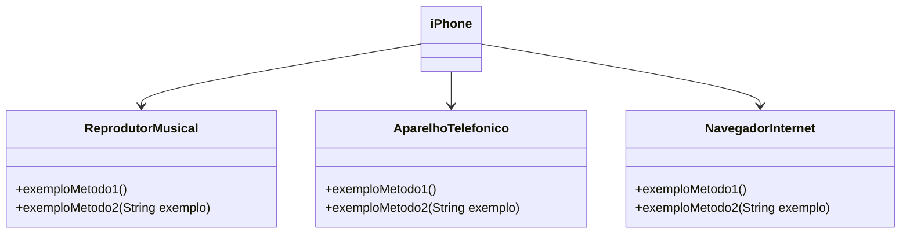

# POO - Desafio
 
## Modelagem e Diagramação de um Componente iPhone
 
Neste desafio, fui responsável por modelar e diagramar a representação UML do componente iPhone, abrangendo suas funcionalidades como Reprodutor Musical, Aparelho Telefônico, Navegador na Internet e Câmera.
 
---
## Funcionalidades Modeladas
 
### 1. Reprodutor Musical (`ReprodutorMusical`)
- `tocar(String musica)`
- `pausar()`
- `selecionarMusica(String musica)`
 
### 2. Aparelho Telefônico (`AparelhoTelefonico`)
- `ligar(String numero)`
- `atender()`
- `recusarLigacao()`
- `iniciarCorreioDeVoz()`
- `adicionarContato(String contato)`
- `removerContato(String contato)`
- `enviarEmailContato(String mensagem, String contato)`
 
### 3. Navegador na Internet (`NavegadorInternet`)
- `exibirPagina(String url)`
- `adicionarNovaAba()`
- `atualizarPagina()`
 
### 4. Câmera (`Camera`)
- `tirarFoto()`
 
---
## Diagrama UML
 

 
---

# Exercicio Proposto
[DIO](www.dio.me) - Trilha Java Básico

## Autores
- [Gleyson Sampaio](https://github.com/glysns)

### Objetivo
1. Criar um diagrama UML que represente as funcionalidades descritas acima.
2. Implementar as classes e interfaces correspondentes em Java (Opcional).

### Exemplo de Diagrama UML (Mermaid)


### Instruções
1. Assista ao vídeo do lançamento do iPhone para entender as funcionalidades principais.
2. Utilize uma ferramenta UML de sua preferência para criar o diagrama das classes e interfaces. Você pode utilizar o modelo acima (criado na sintaxe [Mermaid](https://mermaid.js.org/)), uma alternativa open-source e compatível com arquivos Markdown como este.
3. Opcionalmente, caso esteja cheio(a) de confiança, pode implementar as classes Java representadas em seu diagrama UML.
4. Submeta seu repositório GitHub conforme as orientações da plataforma DIO. Por exemplo:

```bash
https://github.com/glysns/trilha-java-basico/desafios/poo/README.md
```` 
